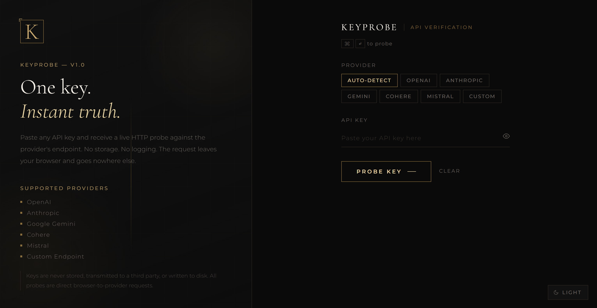
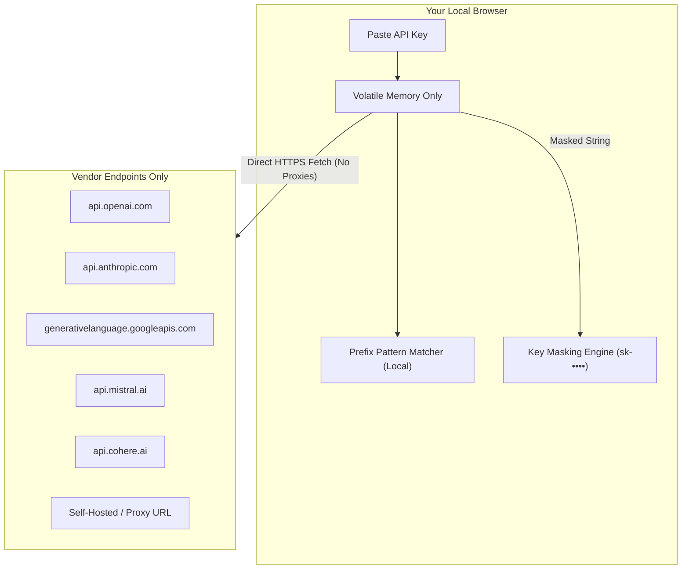

<div align="center">

# 🔑 KeyProbe

### *One Key. Instant Truth.*

**A zero-knowledge, client-side API verification engine & diagnostic suite for AI developers.**

[](https://www.typescriptlang.org/)
[](https://vitejs.dev/)
[](package.json)
[](#-security--zero-knowledge-guarantee)
[](LICENSE)

<br />

<p align="center">
  <a href="#-key-features">Key Features</a> •
  <a href="#-supported-providers">Supported Providers</a> •
  <a href="#-security--zero-knowledge-guarantee">Security Model</a> •
  <a href="#-quick-start">Quick Start</a> •
  <a href="#-architecture">Architecture</a> •
  <a href="#-adding-custom-providers">Extending</a> •
  <a href="#-deployment">Deployment</a>
</p>

<br />

<p align="center">
  
</p>

---

</div>

## 📖 Overview

**KeyProbe** is an ultra-fast, client-side cryptographic and HTTP verification utility designed to validate AI and cloud API keys instantly without sacrificing security. 

Most online API testing tools route sensitive credentials through a third-party proxy backend, creating severe risks of key leakage, credential harvesting, or unintentional logging. **KeyProbe eliminates the middleman**: all probes are dispatched directly from your browser sandbox straight to the official provider endpoints via the standard Fetch API.

```
┌─────────────────┐        Direct HTTPS (CORS / Probe)        ┌───────────────────────┐
│                 │ ─────────────────────────────────────────► │  Provider Endpoint    │
│  User Browser   │                                            │  (OpenAI, Anthropic,  │
│  (KeyProbe App) │ ◄───────────────────────────────────────── │   Google, Mistral...) │
└─────────────────┘              HTTP Telemetry                └───────────────────────┘
         │
         ▼
 ✖ No Backend Server
 ✖ No Proxy Intermediary
 ✖ No Persistent Key Storage
 ✖ No Remote Analytics or Tracking
```

---

## ✨ Key Features

- 🛡️ **True Zero-Knowledge Architecture**  
  Keys are never stored on disk, never written to a database, and never forwarded to any telemetry server. Everything executes strictly in-memory within your browser session.

- 🧠 **Intelligent Key Auto-Detection**  
  KeyProbe analyzes string structure and known cryptographic vendor prefixes (e.g., `sk-proj-`, `sk-ant-`, `AIza`) to automatically detect and select the matching provider the moment you paste.

- ⚡ **High-Resolution Latency Profiling**  
  Calculates round-trip probe latency using browser high-precision timers (`performance.now()`), displaying real-time connection response timings down to the millisecond.

- 🔌 **Universal Custom Endpoint Testing**  
  Validate local LLM servers (Ollama, LM Studio, vLLM, LocalAI), enterprise gateways (Azure OpenAI, OpenRouter, Groq, Together AI), or custom microservices with custom base URLs and custom authorization header definitions.

- 🎨 **Adaptive Luxury UI & Full Device Agnosticism**  
  Meticulously engineered with responsive typography, dark/light theme persistence, mobile swipe tabs, and sticky action docks for seamless operation across smartphones, tablets, laptops, and ultra-wide displays.

- ⌨️ **Keyboard-First Workflow**  
  Press <kbd>⌘</kbd>+<kbd>Enter</kbd> (or <kbd>Ctrl</kbd>+<kbd>Enter</kbd>) to trigger instant probes without lifting your fingers from the keyboard.

- 📋 **Automated Result Masking & One-Click Export**  
  Recent history items automatically mask secret values (`sk-proj-••••••••4f2a`), and complete diagnostic results can be copied to your clipboard in one click.

---

## 🛰️ Supported Providers

| Provider | Detected Prefix | Probe Endpoint | Auth Mechanism | Docs |
| :--- | :--- | :--- | :--- | :---: |
| **OpenAI** | `sk-proj-`, `sk-` | `https://api.openai.com/v1/models` | `Authorization: Bearer <key>` | [Console](https://platform.openai.com/api-keys) |
| **Anthropic** | `sk-ant-` | `https://api.anthropic.com/v1/models` | `x-api-key: <key>` | [Console](https://console.anthropic.com/settings/keys) |
| **Google Gemini** | `AIza` | `https://generativelanguage.googleapis.com/v1beta/models` | Query Parameter `?key=<key>` | [AI Studio](https://aistudio.google.com/app/apikey) |
| **Cohere** | Manual / Custom | `https://api.cohere.ai/v1/models` | `Authorization: Bearer <key>` | [Dashboard](https://dashboard.cohere.com/api-keys) |
| **Mistral AI** | Manual / Custom | `https://api.mistral.ai/v1/models` | `Authorization: Bearer <key>` | [Console](https://console.mistral.ai/api-keys) |
| **Custom Endpoints** | Any | *User defined* (e.g., Ollama, vLLM, OpenRouter) | Configurable header (default: `Authorization`) | Custom |

---

## 🔒 Security & Zero-Knowledge Guarantee

When dealing with production API keys, trust requires absolute transparency. KeyProbe enforces strict security safeguards:



1. **Direct Egress Only**: HTTP requests originate solely from the browser window directly to the vendor's API servers.
2. **Zero Storage by Default**: `localStorage` is used **only** to persist UI theme preferences (`light` vs `dark`). Keys are never saved to `localStorage`, `sessionStorage`, cookies, or `IndexedDB`.
3. **Audit-Ready & Zero Dependencies**: The entire codebase is written in concise TypeScript with **zero external runtime dependencies**. You can audit all network calls in under 5 minutes by reviewing [`src/tester.ts`](src/tester.ts) and [`src/providers.ts`](src/providers.ts).

---

## 🚀 Quick Start

### Prerequisites
- Node.js `18.0.0` or higher
- npm, pnpm, or yarn

### 1. Clone the repository
```bash
git clone https://github.com/your-username/keyprobe.git
cd keyprobe
```

### 2. Install dependencies
```bash
npm install
```

### 3. Launch development server
```bash
npm run dev
```
Open your browser at `http://localhost:5173`.

### 4. Build for production
```bash
npm run build
```
Outputs optimized static assets to the `dist/` directory.

### 5. Preview production build locally
```bash
npm run preview
```

---

## 🏗️ Architecture & Project Structure

The project is structured around modular, lightweight TypeScript components:

```
keyprobe/
├── 📁 src/
│   ├── 📄 main.ts         # Application entry point & lifecycle bootstrap
│   ├── 📄 providers.ts    # Provider configurations, endpoints, and detection heuristics
│   ├── 📄 tester.ts       # Probe execution coordinator, state store, and key masking
│   ├── 📄 theme.ts        # Dark / Light theme engine with OS preference synchronization
│   ├── 📄 types.ts        # Strongly typed domain models (ProviderId, ProbeResult, etc.)
│   ├── 📄 ui.ts           # DOM binding, animation dispatch, and rendering controllers
│   └── 🎨 style.css       # Responsive design system, CSS custom properties, media queries
├── 📄 index.html          # Semantic HTML5 shell with accessibility landmarks
├── 📄 package.json        # Build scripts and development dependencies
├── 📄 tsconfig.json       # Strict TypeScript compiler options
└── 📄 vite.config.ts      # Vite configuration
```

---

## 🧩 Adding Custom Providers

Expanding KeyProbe to support new cloud or model providers is straightforward. Simply add an entry to the `PROVIDERS` array in [`src/providers.ts`](src/providers.ts):

```typescript
// src/providers.ts
{
  id: 'groq',
  label: 'Groq',
  prefix: ['gsk_'],
  docsUrl: 'https://console.groq.com/keys',
  test: (key: string) =>
    probe(
      'https://api.groq.com/openai/v1/models',
      { Authorization: `Bearer ${key}` },
      'groq',
      'Groq',
    ),
}
```

Then add `'groq'` to the `ProviderId` union in [`src/types.ts`](src/types.ts):

```typescript
// src/types.ts
export type ProviderId = 'openai' | 'anthropic' | 'gemini' | 'cohere' | 'mistral' | 'groq' | 'custom';
```

Vite's hot-module replacement will automatically register the new provider pill and detection pattern.

---

## 🌐 Deployment

KeyProbe compiles to a 100% static client bundle (`HTML`, `CSS`, and vanilla `JS`), allowing it to be deployed in seconds to any static platform:

### Deploy to Vercel
```bash
npx vercel
```

### Deploy to Netlify
```bash
npx netlify deploy --prod --dir=dist
```

### Deploy to Cloudflare Pages / GitHub Pages
Set the build command to:
```bash
npm run build
```
And set the publish/output directory to:
```bash
dist
```

---

## ⌨️ Keyboard Shortcuts

| Shortcut | Action |
| :--- | :--- |
| <kbd>⌘</kbd> + <kbd>Enter</kbd> / <kbd>Ctrl</kbd> + <kbd>Enter</kbd> | Probe Key |
| <kbd>Tab</kbd> / <kbd>Shift</kbd> + <kbd>Tab</kbd> | Navigate Provider Pills & Inputs |
| <kbd>Esc</kbd> (when focused) | Clear active fields |

---

## 🤝 Contributing

Contributions, issues, and feature requests are welcome!

1. Fork the Project
2. Create your Feature Branch (`git checkout -b feature/AmazingFeature`)
3. Commit your Changes (`git commit -m 'Add some AmazingFeature'`)
4. Push to the Branch (`git push origin feature/AmazingFeature`)
5. Open a Pull Request

---

## 📄 License

Distributed under the MIT License. See `LICENSE` for more information.

---

<div align="center">
  <sub>Crafted for developers who care about security, speed, and elegance.</sub>
</div>

